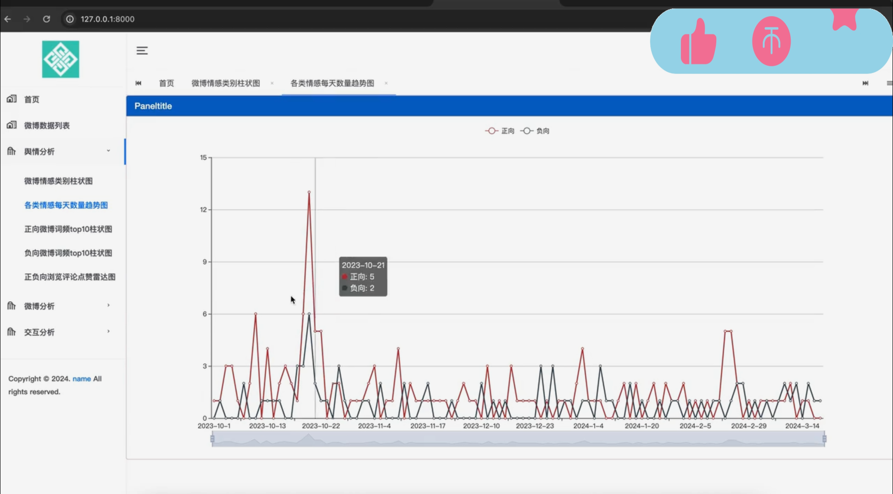

## 计算机毕业设计Python+LSTM模型微博情感分析 微博舆情预测 微博爬虫 微博大数据 舆情分析系统 大数据毕业设计 NLP文本分类 机器学习 深度学习 AI

## 要求
### 源码有偿！一套(论文 PPT 源码+sql脚本+教程)

### 
### 加好友前帮忙start一下，并备注github有偿微博情感分析
### 我的QQ号是2827724252或者798059319或者 1679232425或者微信:bysj2023nb

# 

### 加qq好友说明（被部分 网友整得心力交瘁）：
    1.加好友务必按照格式备注
    2.避免浪费各自的时间！
    3.当“客服”不容易，repo 主是体面人，不爆粗，性格好，文明人。
## 简介
开发工具：Pycharm navicat
后端：python Django
前端： bootstrap
算法：随机森林模型 textcnn
框架： keras sklearn

微博爬虫
模型训练：
随机森林
textcnn
数据入库：使用pandas进行数据清洗合和入库
首页：文章数量 点赞数 最多城市 微博每天发布数量趋势图
微博数据列表
舆情分析：
微博情感类别柱状图
各类情感每天数量趋势图
正向微博词频top10柱状图
负向微博词频top10柱状图
正负向浏览评论点赞雷达图
微博分析：
各省份发布数量地图
评论词云图
交互分析：
微博点赞量区间柱状图
微博转发量区间柱状图
微博评论量区间柱状图
## 演示视频
https://www.bilibili.com/video/BV11YqwYUE5H/?spm_id_from=333.999.0.0
## 运行截图

